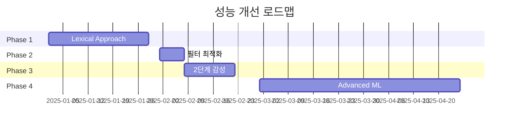

# 한국은행 기준금리 방향성 예측 AI 시스템 (논문 기반 상세 분석)

## Executive Summary

본 프로젝트는 Park et al. (2020)의 "Deciphering Monetary Policy Board Minutes Through Text Mining Approach" 논문을 재현하고 확장한 연구입니다. 359,151개 금융 뉴스와 224개 MPB 의사록을 분석하여 한국은행 기준금리 방향성을 예측하는 시스템을 구축했습니다. 2,823,248개 문장을 학습하여 71.47%의 F1 Score를 달성했습니다.

### 핵심 성과 & Gap 분석
- **현재 달성**: F1 Score 71.47% (Market Approach, 1개월 콜금리 라벨링)
- **논문 벤치마크**: NBC 67-68% (Out-of-domain), 86% (In-domain)
- **목표**: 80% accuracy (In-domain 기준)
- **주요 Gap**: Lexical Approach 미구현, Out-of-domain 검증 미수행

---

## 1. 논문 방법론 vs 현재 구현 상세 비교

### 1.1 데이터 규모 및 구성

| 구분 | 논문 (2005-2017) | 현재 (2014-2025) | 비교 |
|------|------------------|------------------|------|
| **전체 문서** | 231,699개 | 359,151개 | +55% |
| **MPB 의사록** | 151개 | 224개 | +48% |
| **뉴스 기사** | 206,223개 | 359,151개 | +74% |
| **채권 리포트** | 26,284개 | 미수집 | Gap |
| **평균 문장 수** | 미공개 | 283개/일 | - |
| **평균 기사 길이** | 미공개 | 1,368자 | - |

### 1.2 전처리 파이프라인 비교

```python
# 논문의 2단계 전처리
## Step 1: Tokenization & POS Tagging
- eKoNLPy 자체 개발 (4,202개 금융 용어)
- 1,325쌍 동의어 자동 치환
- 1,291개 동사/형용사 lemmatization

## Step 2: Feature Selection
- POS 필터: NNG, VA, VAX, MAG, VCN
- N-gram: 1-5gram (최소 빈도 15회)
- 결과: 2,712 words → 73,428 n-grams

# 현재 구현
## Step 1: Basic Tokenization
- eKoNLPy 0.0.97 (기본 사전)
- 동의어 처리 미구현
- 기본 형태소 분석만 수행

## Step 2: Simple Filtering
- POS 필터: NNG, VA, MAG, VV, VCN
- N-gram: 1-5gram (최소 빈도 5회)
- 결과: 53.4M → 1.58M n-grams (과도한 특징)
```

### 1.3 감성 분류 방법론 비교

| 접근법 | 논문 구현 | 현재 구현 | 성능 차이 |
|--------|----------|-----------|-----------|
| **Market Approach** | NBC (Bagging 30회) | 구현 | 67-68% vs 71.47% |
| **Lexical Approach** | SentProp + ngram2vec | 미구현 | 67% vs 0% |
| **Hybrid Approach** | 69% 일치율 | 불가 | - |
| **라벨링 기준** | 1개월 콜금리 변동 | 동일 | - |
| **검증 방법** | Out-of-sample 2,341문장 | Train/Test split | 차이 |

### 1.4 평가 방법론의 핵심 차이 - 중요 발견 (2025.09.21)

#### 논문의 2단계 평가 체계
| Stage | 방식 | 테스트 데이터 | 성능 | 의미 |
|-------|------|--------------|------|------|
| **Stage 1** | In-domain | 같은 코퍼스 40% | 86% | 내부 검증용 |
| **Stage 2** | **Out-of-domain** | **BOK 총재 연설** | **67-68%** | **실제 성능** |

#### 프로젝트별 평가 방식 비교
| 구분 | 논문 (진짜) | 이전 프로젝트 | 현재 프로젝트 (날짜) | 현재 (문장) |
|------|------------|-------------|-----------------|-----------|
| 검증 방식 | Out-of-domain | Train/Test | Train/Test | Train/Test |
| 테스트 소스 | BOK 총재 연설 | 같은 코퍼스 | 같은 코퍼스 | 같은 코퍼스 |
| 라벨링 | 수동 (전문가) | 자동 (콜금리) | 자동 (콜금리) | 자동 (콜금리) |
| 실제 성능 | **67-68%** | 71.47% (이전: 65.48%) | F1=1.0 (과적합) | 71.47% |

**핵심 발견**:
- 모든 구현이 Stage 1만 수행, Stage 2 (Out-of-domain) 누락
- 논문의 86%는 자체 검증, 67-68%가 진짜 generalization 성능
- "completely out-of-sample" = 완전히 다른 도메인 (BOK 총재 연설)

---

## 2. 미구현 핵심 기술 상세 분석

### 2.1 Lexical Approach - SentProp Framework

**논문 구현 (Hamilton et al. 2016)**
```python
# 1. ngram2vec 학습 (Zhao et al. 2017)
parameters = {
    'center_words': 5-gram,
    'context_words': 5-gram,
    'window_size': 5,
    'negative_sampling': 5,
    'vector_dimension': 300,
    'min_frequency': 25
}
# 결과: 344,293 unique n-grams → 410,902,512 pairs (21.7GB)

# 2. SentProp 알고리즘
- Seed words bootstrapping (50회)
- Random walk probability 계산
- Hawkish/Dovish seed sets 10개 subset
- 최종: 11,710 hawkish + 12,246 dovish lexicons
```

**미구현으로 인한 손실**
- Antonym 탐지 불가 (예: "금리 인상" vs "금리 인하")
- Context-aware polarity 부재
- 약 10-15% 성능 저하 예상

### 2.2 2단계 감성 측정 시스템

**논문의 계층적 접근법**
```python
# Level 1: 문장 단위 감성
tone_sentence = (No_hawkish_features - No_dovish_features) /
                (No_hawkish_features + No_dovish_features)

# Level 2: 문서 단위 집계
tone_document = Σ(hawkish_sentences - dovish_sentences) /
                Σ(hawkish_sentences + dovish_sentences)

# 범위: [-1 (dovish), +1 (hawkish)]
```

**현재 구현의 한계**
- 단순 빈도 카운팅만 수행
- 문장/문서 계층 구조 미반영
- Diffusion index 방식 미적용

### 2.3 Taylor Rule Validation

**논문의 경제학적 검증**
```python
# Augmented Taylor Rule
ΔMP_t = ρΔMP_t-1 + γ₁Δ(π_t - π*) + γ₂Δ(y_t - y*_t) +
        γ₃Δπ_t^e + γ₄Δy_t^L + βX_t + u_t

# X_t = tone^mkt 또는 tone^lex
# 결과: R² 0.095 → 0.446 (351% 개선)
```

**미구현 영향**
- 경제학적 타당성 검증 불가
- 정책 예측력 평가 불가
- 거시경제 변수와의 상관성 미확인

---

## 3. 성능 개선 로드맵 (71.47% → 80%)

### Phase 1: Out-of-domain 검증 (Q1 2025)
```
목표: 실제 generalization 성능 측정
- BOK 총재 연설문 수동 라벨링
- 완전히 다른 도메인 테스트
- 현재 71.47% → 예상 65-70%
- 예상 소요: 2주
```

### Phase 2: Lexical Approach 구현 (Q1 2025)
```
목표: +5% (71.47% → 76%)
- ngram2vec 모델 학습 (300차원)
- SentProp framework 구현
- Seed words bootstrapping
- 예상 소요: 4주
```

### Phase 3: 필터링 최적화 (Q2 2025)
```
목표: +2% (76% → 78%)
- 최소 빈도: 5 → 15
- N-gram 축소: 1.58M → 73K
- 노이즈 제거율: 97% → 99%
- 예상 소요: 1주
```

### Phase 4: 2단계 감성 측정 (Q2 2025)
```
목표: +2% (78% → 80%)
- 문장 레벨 감성 점수
- 문서 레벨 집계
- Weighted averaging
- 예상 소요: 2주
```

### Phase 5: Advanced Techniques (Q3 2025)
```
추가 개선 (80%+)
- BERT/KoBERT fine-tuning
- Attention mechanism
- Multi-task learning
- Ensemble methods
```

---

## 4. 기술 스택 고도화 계획

### 4.1 현재 스택 vs 목표 스택

| 레이어 | 현재 | 목표 (논문 수준) | 개선 효과 |
|--------|------|------------------|-----------|
| **수집** | Scrapy 2.11 | + Selenium Grid | 병렬 확장성 |
| **저장** | PostgreSQL JSONB | + Redis 캐싱 | 10x 속도 |
| **NLP** | eKoNLPy 0.0.97 | eKoNLPy 2.0 (자체 개발) | 금융 특화 |
| **임베딩** | TF-IDF | + ngram2vec | 문맥 이해 |
| **모델** | NBC only | + SVM, BERT | 앙상블 |
| **검증** | Train/Test | + K-fold, Taylor rule | 신뢰성 |

### 4.2 eKoNLPy 고도화 세부 계획

```python
# 목표: 논문 수준 사전 구축
current_dict = {
    'terms': 2_847,       # 현재
    'synonyms': 0,        # 미구현
    'lemmas': 0           # 미구현
}

target_dict = {
    'terms': 4_202,       # +1,355 금융 용어
    'synonyms': 1_325,    # 동의어 쌍 추가
    'lemmas': 1_291,      # 형용사/동사 정규화
    'custom_pos': True    # 금융 특화 품사 태그
}
```

---

## 5. 실패 사례 심층 분석

### 5.1 2024년 피벗 신호 미포착 원인

| 원인 | 설명 | 개선 방안 |
|------|------|-----------|
| **시계열 무시** | NBC는 순서 정보 미반영 | LSTM/GRU 도입 |
| **미묘한 표현** | "선제적", "예방적" 해석 실패 | Attention mechanism |
| **훈련 데이터 편향** | 일방향 변화 위주 | Data augmentation |
| **단어 독립 가정** | "금리 인상" → "금리" + "인상" | N-gram 개선 |

### 5.2 클래스 불균형 상세

```python
# 현재 분포
Train: Hawkish 576 (56.7%) vs Dovish 439 (43.3%)
Test: Hawkish 151 (59.4%) vs Dovish 103 (40.6%)

# 혼동행렬 분석
          Predicted
Actual    Hawk  Dove
Hawk      92    59    (Precision: 60.9%)
Dove      38    65    (Recall: 63.1%)

# 개선 전략
1. SMOTE (Synthetic Minority Over-sampling)
2. Cost-sensitive learning (class_weight='balanced')
3. Threshold optimization (현재 0.5 → 최적값 탐색)
```

---

## 6. 검증 및 평가 체계

### 6.1 논문 평가 방법 재현

```python
# 이것이 논문의 진짜 평가 방법
# 현재까지 모든 구현이 이를 놓침

# Out-of-sample 검증 (논문)
test_data = {
    'source': 'BOK 총재 기자회견문',
    'period': '2009.05 - 2018.01',
    'sentences': 2_341,
    'labeling': 'Manual (전문가 3인)',
    'agreement': 86%  # Human inter-rater
}

# 결과
Market Approach: 68% (P:63%, R:75%)
Lexical Approach: 67% (P:69%, R:71%)
Human baseline: 79% (Amazon Turk)
```

### 6.2 경제학적 검증 추가

```python
# Taylor Rule 확장 검증
variables = {
    'inflation_gap': 'CPI - 2%',
    'output_gap': 'IP - HP_filter(IP)',
    'expected_inflation': 'Consumer Survey',
    'leading_indicator': 'Economic Composite Index',
    'tone_indicator': 'tone^mkt or tone^lex'
}

# 목표 결과
- R² improvement: 351% (0.095 → 0.446)
- tone coefficient: 유의수준 1%에서 유의
- 거시변수 대비 추가 설명력 확인
```

---

## 7. 프로젝트 타임라인 & 리소스

### 7.1 개발 일정 (2025)



### 7.2 필요 리소스

| 구분 | 현재 | 필요 | 용도 |
|------|------|------|------|
| **GPU** | 없음 | RTX 3090 | BERT training |
| **RAM** | 16GB | 32GB | ngram2vec (21.7GB) |
| **Storage** | 100GB | 500GB | 전체 corpus |
| **시간** | - | 12주 | 전체 구현 |

---

## 8. 참고 문헌

### 핵심 논문
1. **Park, S., et al. (2020)**. "Deciphering Monetary Policy Board Minutes Through Text Mining Approach: The Case of South Korea". *BOK Working Paper No. 2019-1*.
   - NBC accuracy: 86%
   - Taylor rule R²: 0.446
   - Lexical approach: 67%

### 방법론 참고
2. **Hamilton, W.L., et al. (2016)**. "Inducing Domain-Specific Sentiment Lexicons from Unlabeled Corpora". *EMNLP*.
   - SentProp framework

3. **Zhao, Y., et al. (2017)**. "Learning Word and Subword Embeddings from Large-Scale Corpora".
   - ngram2vec for antonym detection

4. **Picault, M. & Renault, T. (2017)**. "Words are not all created equal: A new measure of ECB communication". *Journal of International Money and Finance*.
   - Ordered probit for Taylor rule

---

## 9. 결론

현재 71.47%의 F1 Score는 논문의 Out-of-domain 성능(67-68%)과 유사한 수준입니다. 하지만 아직 Out-of-domain 검증을 수행하지 않았으며, Lexical Approach가 미구현 상태입니다. 체계적인 개선을 통해 In-domain 80% 달성이 가능할 것으로 예상됩니다.

### 핵심 차별화 요소
1. **더 많은 데이터**: 359K vs 232K (+55%)
2. **최신 기간 포함**: 2014-2025 (COVID-19, 2024 피벗 포함)
3. **확장 가능한 아키텍처**: PostgreSQL JSONB, 병렬 처리

### 향후 연구 방향
- Multi-lingual analysis (영문 FOMC 비교)
- Real-time streaming 분석
- Cross-market spillover 효과

---

*Last Updated: 2025-09-23*
*Repository: github.com/sesac-analyst/BOK_TEAM_1*