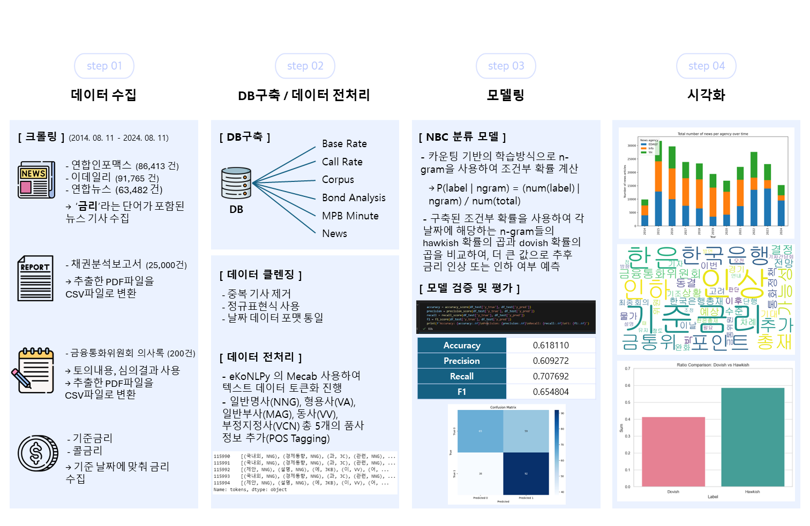

# Korea Policy Rate Prediction
> Forecasting Bank of Korea's Base Rate (한국은행 기준금리) using financial text mining
## 1. 프로젝트 개요


## 2. 프로젝트 목적
Based on the paper "Deciphering Monetary Policy Board Minutes with Text Mining: The Case of South Korea", this project predicts Korea's policy rate (Bank of Korea Base Rate) direction using financial text mining and machine learning approaches.

**Key Data Sources:**
- Bank of Korea Monetary Policy Board minutes
- Financial news articles (Yonhap, Edaily, InfoMax)  
- Bond analysis reports from securities firms
- Call rate and interest rate data

**Methodology:**
Financial text → NLP preprocessing → Sentiment analysis → ML/DL models → Policy rate direction prediction
<!-- - 프로젝트 기간 : 2024.08.08 - 2024.08.28
- 프로그래밍 언어 : Python
- 팀원 : 김도형, 김관용, 원형일, 윤종헌, 이현정 -->

<br/>

## 3. 프로젝트 기간
- **1차 개발**: 2024년 8월 8일 - 2024년 8월 28일 (기본 시스템 구축)
  - [1차 개발 레포지토리](https://github.com/sesac-analyst/BOK_TEAM_1)
- **2차 개발**: 2025년 7월 - 현재 (시스템 안정화 및 개선)


<br/>


## 4. 개발 현황

### **완료된 작업** (1차)
- 기본 크롤링 시스템 구축
- 데이터 전처리 파이프라인 (eKoNLPy 기반)
- NBC 모델링 구현 (부분적)
- n-gram 기반 감성 분석 프레임워크

### **진행 중인 작업** (2차)
- 크롤링 시스템 안정화 및 성능 개선
- 데이터 수집 완료 (MPB, 뉴스, 채권, 금리)
- 전체 파이프라인 재구성 및 최적화

### **계획된 작업**
- 개선된 모델링 및 평가
- 실시간 예측 시스템 구축
- 성능 벤치마킹 및 검증

### **현재 성능 지표** (2025-09-23 기준)
| 모델 | F1 Score | Precision | Recall | Accuracy |
|------|----------|-----------|--------|-----------|
| NBC (30x Bagging) | **71.47%** | 70.22% | 72.77% | 67.79% |
| 논문 벤치마크 | 67-68% | - | - | - |

- 총 2,823,248개 문장으로 학습
- 1개월 후 콜금리 변동 기반 라벨링 (논문과 동일)

<br/>

## 5. 프로젝트 환경 및 언어
**개발 환경** : Visual Studio Code, Jupyter Lab, PostgreSQL, Github  

**개발 언어 및 모듈** : Python 3.12, PostgreSQL, Pandas, Numpy, eKoNLPy, Scrapy, PyPDF2, BeautifulSoup4, scikit-learn, MeCab

**데이터베이스** : PostgreSQL (한국어 텍스트 최적화, JSONB 지원)


<br/>

## 6. 팀 구성
- 김도형(팀장) : dkswhale@gmail.com      
- 김관용 : kwanyou2@gmail.com  
- 윤종헌 : yoonjh0420@gmail.com  
- 이현정 : rachel918@hanmail.net  
- 원형일 : raphawon@gmail.com

<br/>

## 7. 빠른 시작 (Quick Start)

### 환경 설정
```bash
# 1. Conda 환경 생성 및 활성화
conda create -n ds_env python=3.12
conda activate ds_env

# 2. 의존성 설치
pip install -r requirements.txt

# 3. PostgreSQL 설정 (선택사항)
brew install postgresql  # macOS
brew services start postgresql
createdb mpb_stance_mining

# 4. 환경변수 설정
cp .env.example .env
# .env 파일을 편집하여 PostgreSQL 설정 입력
```

### 데이터 수집 실행
```bash
# MPB, 금리, 채권 데이터 수집
./crawler/scripts/run_auxiliary_collectors.sh

# 뉴스 데이터 수집
./crawler/scripts/run_news_collector.sh

# 개별 크롤러 실행 (예시)
cd crawler/MPB
scrapy crawl mpb_crawler_perfect -o ../../data/mpb_minutes.json
```

### 모델 학습 및 평가
```bash
# 전체 문장 단위 NBC 파이프라인 실행
./run_sentence_pipeline.sh

# 결과 확인
cat modeling/sentence_nbc/model_stats.json
```

### 시각화 생성
```bash
# 실제 데이터 기반 시각화
python visualizations/real_visualization_generator.py
```


<!-- #### 1. 프로젝트 목적
##### 금융통화위원회 의사록, 언론사 기사, 채권분석 리포트의 ***text***를 자연어 처리를 통해
##### 머신러닝에 활용 할 수 있는 ***data***로 변환시켜 1개월 후 콜금리 변동 기반 Dovish/Hawkish 방향성 분류
#### 2. 프로젝트 기간
##### 2024년 8월 8일 ~ 2024년 8월 28일
#### 3. 프로젝트 진행
##### 3-1. 데이터 수집
   ##### - 연합뉴스, 연합인포맥스, 이데일리
   ##### - 채권분석 리포트
   ##### - 금융통화위원회 의사록
   ##### - 콜 금리
##### 3-2. 데이터 전처리
##### 3-3. 모델링 및 평가
#### 4. 프로젝트 환경
##### Visual Studio Code, Jupyter Lab, Notion, Github, SLACK

##### Python 3.8, Pandas, Numpy, Multiprocessing

#### 5. 팀(BOK_TEAM_1) 구성 

##### 김도형(팀장), 김관용, 윤종헌, 이현정, 원형일 -->