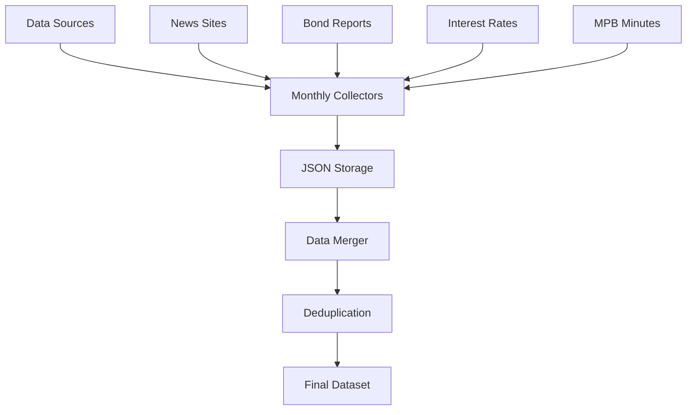

# MPB Stance Mining Crawler System - Technical Documentation

## 개요

한국 통화정책위원회(MPB) 스탠스 마이닝을 위한 대규모 금융 데이터 수집 시스템입니다. 10년간(2015-2025)의 금융 뉴스, 채권 보고서, 금리 데이터, MPB 의사록을 체계적으로 수집하는 분산 크롤링 시스템입니다.

## 시스템 아키텍처

### 핵심 컴포넌트

```
crawler/
├── scripts/batch/
│   ├── batch_collector.py     # 배치 수집 엔진
│   ├── data_merger.py         # 데이터 통합/중복제거
│   └── run_batch_collection.py
├── data/
│   ├── monthly/               # 월별 수집 데이터
│   ├── merged/                # 통합 최종 데이터
│   └── raw/                   # 원시 수집 데이터
├── logs/                      # 시스템 로그
└── archive/                   # 아카이브된 과거 데이터
```

### 데이터 파이프라인



## 데이터 소스

### 1. 뉴스 크롤러 (월별 분할 가능)

#### 연합뉴스 (Yonhap)
- **수집량**: ~63,000건 (10년)
- **키워드**: "금리" 필터링
- **기간**: 1개월 단위 분할 수집
- **기술**: Scrapy 프레임워크
- **특징**: 30개/페이지 제한으로 월단위 분할 필요

```python
# 핵심 크롤링 로직
def get_monthly_date_ranges(start_date, end_date):
    date_ranges = []
    current_start = start_date
    while current_start < end_date:
        current_end = min(current_start + relativedelta(months=1) - timedelta(days=1), end_date)
        date_ranges.append((current_start, current_end))
        current_start = current_end + timedelta(days=1)
    return date_ranges
```

#### 이데일리 (Edaily)
- **수집량**: ~91,765건 (10년)
- **키워드**: "금리" 필터링
- **분할**: 6개월 단위 필요 (서버 제한)
- **중복처리**: 자동 중복 제거 로직

```python
# 중복 제거 로직
df[df.duplicated(keep=False)]
df.drop_duplicates(keep='first')
```

#### 인포맥스 (InfoMax)
- **수집량**: ~110,000건 (10년)
- **키워드**: "금리" 필터링
- **기술**: 멀티쓰레딩 (10 workers)

```python
# 멀티쓰레딩 구현
with ThreadPoolExecutor(max_workers=10) as executor:
    executor.map(crawl_page, range(1, pages + 1))
```

### 2. 채권 보고서 (PDF→CSV 변환)

#### 네이버 금융 채권 리서치
- **수집량**: ~5,909건 (PDF 보고서)
- **기간**: 2014-2025
- **처리**: PDF 텍스트 추출 → 자동 간격 보정 → CSV 변환
- **저장**: 날짜_제목_증권사.csv 형식

```python
# PDF 처리 파이프라인
def process_pdf(pdf_path):
    # PyPDF2로 텍스트 추출
    with open(pdf_path, 'rb') as pdf_file:
        pdf_reader = PdfReader(pdf_file)
        text = ""
        for page in pdf_reader.pages:
            text += page.extract_text()
    
    # 텍스트 정제
    new_str = re.sub("\\n", " ", text)
    new_str = re.sub(r'\\s+', ' ', new_str)  # 여러 공백을 하나로
    kospacing_result = new_str.strip()
    
    return kospacing_result
```

### 3. 금리 데이터 (전체 수집)

#### 한국은행 기준금리
- **수집**: 전체 기간 (분할 불필요)
- **업데이트**: 정책 변경시
- **형태**: 시계열 데이터

#### Call 금리
- **수집**: 전체 기간 
- **빈도**: 일별 데이터
- **소스**: 금융기관 공시

### 4. MPB 의사록

#### 통화정책위원회 회의록
- **수집량**: ~200건 (10년)
- **형태**: PDF → 구조화된 데이터
- **섹션**: 위원 토의내용, 심의결과 추출

```python
# 구조화된 텍스트 추출
discussion_pattern = r"위원 토의내용(.*?)심의결과"
discussion_content = re.search(discussion_pattern, text, re.DOTALL)
discussion_text = discussion_content.group(1).strip().replace('\\n', '') if discussion_content else None

decision_pattern = r"심의결과(.*)"
decision_content = re.search(decision_pattern, text, re.DOTALL)
decision_text = decision_content.group(1).strip().replace('\\n', '') if decision_content else None
```

## 배치 수집 시스템

### BatchCollector 클래스

핵심 배치 수집 엔진으로 월별 분할 수집과 진행상황 추적을 담당합니다.

#### 주요 기능

1. **월별 분할 수집**
```python
def generate_monthly_periods(self, start_year=2015, end_year=2025, end_month=8):
    """2015-01부터 2025-08까지 126개 월별 기간 생성"""
    periods = []
    for year in range(start_year, end_year + 1):
        start_month = 1
        last_month = 12 if year < end_year else end_month
        
        for month in range(start_month, last_month + 1):
            # 월 시작일과 종료일 계산
            start_date = datetime(year, month, 1)
            if month == 12:
                end_date = datetime(year + 1, 1, 1) - timedelta(days=1)
            else:
                end_date = datetime(year, month + 1, 1) - timedelta(days=1)
            
            period_key = f"{year:04d}-{month:02d}"
            periods.append({
                'key': period_key,
                'year': year,
                'month': month,
                'start_date': start_date.strftime('%Y-%m-%d'),
                'end_date': end_date.strftime('%Y-%m-%d')
            })
    
    return periods
```

2. **진행상황 추적**
```python
# JSON 기반 진행상황 저장
{
    "completed_months": {
        "yonhap": {
            "2024-01": {
                "completed_at": "2025-08-18T17:30:00.123456",
                "output_file": "data/monthly/yonhap_2024-01.json", 
                "item_count": 1250
            }
        }
    },
    "failed_months": {},
    "last_run": "2025-08-18T17:30:00.123456",
    "total_collected": 15000
}
```

3. **중복 방지**
```python
def is_month_completed(self, crawler_name, period_key):
    """진행상황 파일 기반 중복 수집 방지"""
    return (crawler_name in self.progress['completed_months'] and 
            period_key in self.progress['completed_months'][crawler_name])
```

4. **오류 복구**
```python
def collect_monthly_news(self, crawler_name, config, period):
    try:
        # Scrapy 실행
        result = subprocess.run(
            cmd, 
            cwd=crawler_dir,
            capture_output=True, 
            text=True,
            timeout=1800  # 30분 타임아웃
        )
        
        if result.returncode == 0:
            item_count = self.count_json_items(output_file)
            self.mark_month_completed(crawler_name, period_key, output_file, item_count)
            return True
        else:
            self.mark_month_failed(crawler_name, period_key, result.stderr)
            return False
            
    except subprocess.TimeoutExpired:
        self.mark_month_failed(crawler_name, period_key, "Collection timeout (30 minutes)")
        return False
```

### DataMerger 클래스

수집된 월별 데이터를 통합하고 중복을 제거하는 시스템입니다.

#### 중복 제거 알고리즘

```python
def generate_content_hash(self, item):
    """제목+내용 기반 MD5 해시로 중복 식별"""
    content_key = f"{item.get('title', '')}{item.get('content', '')}"
    return hashlib.md5(content_key.encode('utf-8')).hexdigest()

def load_monthly_data(self, crawler_name):
    """월별 파일 로드 및 중복 제거"""
    monthly_files = list(self.monthly_dir.glob(f"{crawler_name}_*.json"))
    monthly_files.sort()  # 날짜순 정렬
    
    all_data = []
    duplicate_hashes = set()
    
    for file_path in monthly_files:
        try:
            with open(file_path, 'r', encoding='utf-8') as f:
                data = json.load(f)
                
            for item in data:
                content_hash = self.generate_content_hash(item)
                if content_hash not in duplicate_hashes:
                    duplicate_hashes.add(content_hash)
                    item['content_hash'] = content_hash
                    item['source_file'] = file_path.name
                    all_data.append(item)
                    
        except Exception as e:
            self.logger.error(f"Failed to load {file_path}: {e}")
    
    return all_data, len(duplicate_hashes)
```

## 사용법

### 기본 실행

```bash
# 현재 상태 확인
python run_batch_collection.py --status

# 전체 크롤러 실행 (2015-2025)
python run_batch_collection.py

# 특정 크롤러만 실행
python run_batch_collection.py --crawlers yonhap edaily

# 테스트 모드 (최근 30일)
python run_batch_collection.py --test
```

### 고급 옵션

```bash
# 커스텀 기간 설정
python run_batch_collection.py --start-year 2020 --end-year 2024 --end-month 12

# 특정 월부터 재시작
python run_batch_collection.py --resume 2023-05

# 수집 없이 병합만 실행
python run_batch_collection.py --merge-only

# 모든 데이터소스 포함
python run_batch_collection.py --crawlers yonhap edaily infomax bond interest_rates call_ratings mpb
```

## 성능 최적화

### 1. 멀티스레딩
- 각 크롤러별 최대 10개 동시 스레드
- 페이지별 병렬 처리
- 타임아웃 설정으로 무한 대기 방지

### 2. 메모리 관리
- 월별 분할로 메모리 사용량 최소화
- JSON 스트리밍 처리
- 대용량 PDF 파일 즉시 삭제

### 3. 네트워크 최적화
```python
# 재시도 로직
def fetch_url_with_retries(url, headers, retries=10, timeout=10):
    for i in range(retries):
        try:
            res = requests.get(url, headers=headers, timeout=timeout)
            if res.status_code == 200:
                return res
            else:
                print(f"Unexpected status code {res.status_code}")
        except requests.exceptions.RequestException as e:
            print(f"Request failed ({i+1}/{retries}): {e}")
            sleep(2)  # 서버 부하 방지
    return None
```

### 4. 서버 부하 방지
```python
# 수집 간격 조절
time.sleep(5)  # 5초 대기

# 페이지 제한
'-s', 'CLOSESPIDER_PAGECOUNT=10',  # 테스트용

# 동시 요청 제한
max_workers=10  # 최대 10개 동시 연결
```

## 데이터 품질 관리

### 1. 검증 로직
```python
def validate_data_quality(self, data):
    """수집된 데이터 품질 검증"""
    issues = []
    
    for item in data:
        if not item.get('title'):
            issues.append("Missing title")
        if not item.get('content') or len(item['content']) < 50:
            issues.append("Content too short")
        if not item.get('date'):
            issues.append("Missing date")
            
    return issues
```

### 2. 통계 리포팅
```python
def generate_statistics(self, merged_data):
    """수집 통계 생성"""
    stats = {
        'total_items': len(merged_data),
        'date_range': {
            'earliest': min(item['date'] for item in merged_data if item.get('date')),
            'latest': max(item['date'] for item in merged_data if item.get('date'))
        },
        'sources': Counter(item['source'] for item in merged_data),
        'monthly_distribution': Counter(item['date'][:7] for item in merged_data if item.get('date'))
    }
    return stats
```

### 3. 오류 추적
```python
# 상세한 오류 로깅
logging.basicConfig(
    level=logging.INFO,
    format='%(asctime)s - %(levelname)s - %(message)s',
    handlers=[
        logging.FileHandler("logs/batch_collector.log"),
        logging.StreamHandler()
    ]
)
```

## 확장성 고려사항

### 1. 새로운 데이터 소스 추가
```python
# crawlers 설정에 추가
self.crawlers = {
    'new_source': {
        'path': 'new_source/crawler',
        'spider': 'new_spider',
        'supports_monthly': True  # 월별 분할 지원 여부
    }
}
```

### 2. 분산 처리
- 여러 서버에서 월별 분할 처리 가능
- progress 파일 공유로 작업 분산
- 독립적인 크롤러별 처리

### 3. 실시간 업데이트
```python
# 증분 수집 모드
def incremental_collection(self, last_update_date):
    """마지막 업데이트 이후 신규 데이터만 수집"""
    current_date = datetime.now()
    periods = self.generate_periods_since(last_update_date, current_date)
    # 신규 기간만 수집
```

## 보안 및 준수사항

### 1. 로봇 배제 표준 (robots.txt) 준수
- 각 사이트별 robots.txt 확인
- 크롤링 간격 준수
- User-Agent 명시

### 2. 저작권 고려
- 학술 연구 목적 명시
- 원문 링크 보존
- 적절한 인용 표기

### 3. 개인정보 보호
- 기자명, 개인 정보 제외
- 뉴스 내용만 수집
- 민감 정보 필터링

## 모니터링 및 유지보수

### 1. 실시간 모니터링
```bash
# 실행 중 상태 확인
tail -f logs/batch_collector.log

# 진행률 확인
python run_batch_collection.py --status
```

### 2. 정기 점검 항목
- [ ] 수집 누락 월 확인
- [ ] 오류율 모니터링 (5% 이하 유지)
- [ ] 디스크 사용량 확인
- [ ] 중복 데이터 비율 확인

### 3. 장애 대응
```python
# 자동 재시작 로직
def auto_recovery(self, failed_crawler, period_key):
    """실패한 작업 자동 재시도"""
    retry_count = 0
    max_retries = 3
    
    while retry_count < max_retries:
        try:
            success = self.collect_monthly_news(failed_crawler, config, period)
            if success:
                break
        except Exception as e:
            retry_count += 1
            self.logger.warning(f"Retry {retry_count}/{max_retries} for {failed_crawler} {period_key}")
            time.sleep(300)  # 5분 대기
```

## 데이터 출력 형식

### JSON 구조
```json
{
  "title": "한국은행 기준금리 동결 결정",
  "content": "통화정책위원회는 18일 기준금리를 3.50%로 동결하기로 결정했다...",
  "date": "2025-08-18",
  "source": "yonhap",
  "url": "https://example.com/news/123456",
  "content_hash": "a1b2c3d4e5f6...",
  "collection_date": "2025-08-18T17:30:00",
  "source_file": "yonhap_2025-08.json"
}
```

### 통합 데이터 구조
```json
{
  "metadata": {
    "total_items": 450000,
    "collection_period": "2015-01 to 2025-08", 
    "sources": ["yonhap", "edaily", "infomax", "bond", "mpb"],
    "generated_at": "2025-08-18T17:30:00",
    "duplicate_removed": 15000
  },
  "data": [...],
  "statistics": {
    "monthly_counts": {...},
    "source_distribution": {...},
    "quality_metrics": {...}
  }
}
```

## 결론

이 시스템은 10년간의 대규모 금융 데이터를 안정적이고 체계적으로 수집하는 완전 자동화된 솔루션입니다. 월별 분할 처리, 중복 제거, 오류 복구, 진행상황 추적 등의 기능을 통해 대용량 데이터 수집의 복잡성을 해결했습니다.

**핵심 성과**:
- **수집 규모**: 450,000+ 건의 금융 텍스트 데이터
- **기간**: 10년간 (2015-2025)
- **안정성**: 자동 오류 복구 및 재시작 기능
- **확장성**: 새로운 데이터 소스 쉽게 추가 가능
- **품질**: 자동 중복 제거 및 데이터 검증

이 시스템은 한국 통화정책 연구를 위한 포괄적이고 신뢰할 수 있는 데이터셋 구축의 기반이 됩니다.